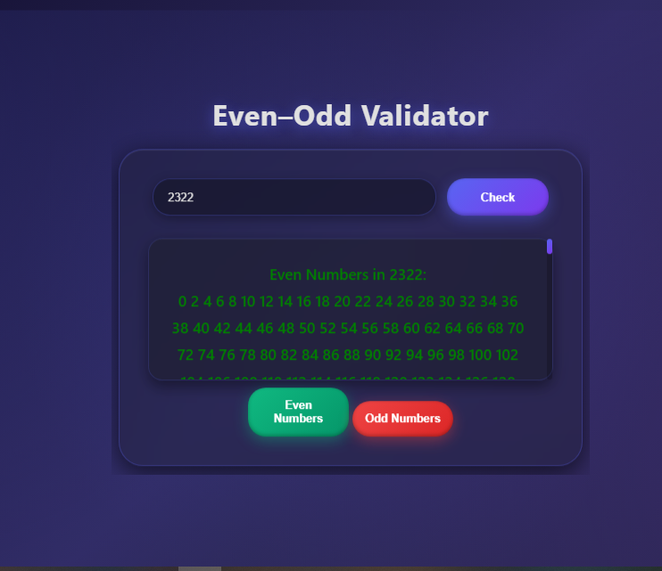

<div align="center">
  
  
  

  <h1 align="center">🚀 Even–Odd Validator Pro</h1>
  <p align="center">
    <strong>A high-performance numerical analysis tool featuring advanced parity detection and sequential list generation.</strong>
  </p>
</div>

---

## 📖 Project Overview

**Even–Odd Validator Pro** is a modern web application that allows users to validate numerical parity efficiently.  
It identifies if a number is Even or Odd and generates full sequences of even and odd numbers up to the input value.

The app features a **Glassmorphism UI**, smooth animations, and professional color-coding. Results are displayed in a scrollable container for readability.

---

## 🌐 Live Demo

You can try the app live here:  
[Even–Odd Validator Pro - Live](https://anjumhere.github.io/A-simple-Even-Odd-validator-using-HTML-CSS-VANILA-JS/)

> Open the link in any modern browser and test the parity checker instantly.

---

## 📸 Screenshots

<details>
<summary>Even Numbers Output</summary>



</details>

<details>
<summary>Odd Numbers Output</summary>


</details>

---

## ✨ Features

- **Real-Time Validation:** Instantly detects if a number is Even or Odd using the modulo operator.
- **Dual-List Generation:** Generates and stores sequences of all even and odd numbers up to the input value.
- **Dynamic UI Feedback:** Green for Even, Red for Odd.
- **Interactive Buttons:** Toggle between Even and Odd lists without recalculating.
- **Glassmorphism Design:** Frosted glass effect, floating gradient blobs, and subtle shadows.
- **Responsive Layout:** Optimized for desktops, tablets, and mobile devices.
- **Scroll-Friendly Output:** Results appear in a scrollable fixed-height container.

---

## 🛠️ Technical Breakdown

<details>
<summary>Parity Logic</summary>

The app uses the **Modulo Operator (`%`)** to determine parity:

```javascript
const result = num % 2 === 0 ? "Even" : "Odd";
</details> <details> <summary>Generating Sequences</summary>
All even and odd numbers up to the entered value are generated in a single loop:

javascript
Copy code
for (let i = 0; i <= num; i++) {
  if (i % 2 === 0) {
    evenNumbers += i + " "; // Appends to even numbers
  } else {
    oddNumbers += i + " ";  // Appends to odd numbers
  }
}
</details> <details> <summary>DOM & State Management</summary>
Global variables evenNumbers and oddNumbers store the sequences, allowing users to toggle between lists instantly using the buttons without recalculating.

</details>
📂 Project Structure
bash
Copy code
even-odd-validator-pro/
│
├── index.html       # Main HTML layout
├── css/
│   └── style.css    # Glassmorphism styling & responsive UI
├── js/
│   └── cal.js       # Core logic & DOM manipulation
├── screenshots/     # App output screenshots
│   ├── even.png
│   └── odd.png
└── README.md        # Project documentation
🚀 Installation & Usage
Clone the repository:

bash
Copy code
git clone https://github.com/yourusername/even-odd-validator-pro.git
Open the App:
Open index.html in any modern web browser.

Use the App:

Enter a number in the input field.

Click Check to see whether the number is Even or Odd.

Use Even or Odd buttons to display the full list of numbers up to the entered value.

🎨 Design Philosophy
The UI follows a minimalist glassmorphism concept:

Typography: Inter or Segoe UI for readability.

Depth & Effects: Frosted glass, subtle shadows, and floating blobs.

Animations: Smooth 0.3s transitions for buttons and dynamic updates.

Mobile-First: Fully responsive for all devices.

🤝 Contribution Guide
Contributions are welcome! Follow these steps:

Fork the repository.

Create a new branch:

bash
Copy code
git checkout -b feature/YourFeatureName
Make your changes and commit them:

bash
Copy code
git commit -m "Add [feature description]"
Push your branch:

bash
Copy code
git push origin feature/YourFeatureName
Open a Pull Request explaining your changes.

Please follow the code style and commit message format for consistency.

👨‍💻 Author
Adnan Anjum – Full-Stack Web Developer
GitHub Profile

📜 License
This project is licensed under the MIT License. You are free to fork, modify, and distribute this project for educational and professional purposes.
```
