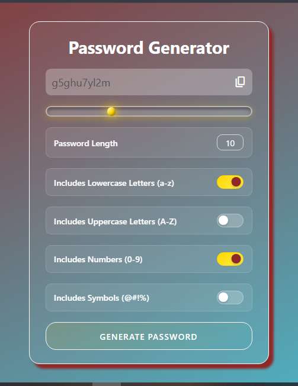

<h1 style="text-align:center;">Random Password Generator</h1>

<h2>Screenshot!</h2>

A modern, interactive password generator built with <strong>HTML</strong>, <strong>CSS</strong>, and <strong>JavaScript</strong>. Designed with a sleek, responsive UI and advanced features like custom character selection and live slider for password length.

<h2>📌 Project Overview</h2>

This project allows users to generate strong, random passwords based on selected criteria. It supports:

<ul>
  <li>Lowercase letters (a-z)</li>
  <li>Uppercase letters (A-Z)</li>
  <li>Numbers (0-9)</li>
  <li>Symbols (!@#$%^&*()_-+=<>?)</li>
</ul>

The password length can be adjusted using an interactive slider, and users can easily copy the generated password with a single click.

<h2>💻 Features</h2>
<ul>
  <li><strong>Responsive Design:</strong> Looks great on desktops and mobile devices.</li>
  <li><strong>Interactive Slider:</strong> Adjust password length with a liquid-tube style slider.</li>
  <li><strong>Character Selection:</strong> Choose exactly which types of characters to include.</li>
  <li><strong>Copy to Clipboard:</strong> One-click password copying with visual feedback.</li>
  <li><strong>Real-Time Slider Value:</strong> Shows the selected password length dynamically.</li>
  <li><strong>Custom Styling:</strong> Smooth gradients, shadows, and hover effects for a modern UI.</li>
</ul>

<h2>🛠️ Technologies Used</h2>
<ul>
  <li><strong>HTML5</strong> – Structure of the application</li>
  <li><strong>CSS3</strong> – Styling, responsive layout, slider customization, and animations</li>
  <li><strong>JavaScript (ES6)</strong> – Password generation logic, slider interaction, and clipboard functionality</li>
</ul>

<h2>📂 Project Structure</h2>
<pre>
password-generator/
│
├── index.html        &lt;!-- Main HTML file --&gt;
├── style.css         &lt;!-- CSS for styling and slider effects --&gt;
└── index.js          &lt;!-- JavaScript for password generation and interaction --&gt;
</pre>

<h2>⚙️ How It Works</h2>

<h3>1. Slider for Password Length</h3>

The password length is controlled by a <code>&lt;input type="range"&gt;</code> element. The current value is displayed dynamically beside the slider.

<h3>2. Character Selection</h3>

The user can select which types of characters they want in the password using checkboxes:

<ul>
  <li>Lowercase letters</li>
  <li>Uppercase letters</li>
  <li>Numbers</li>
  <li>Symbols</li>
</ul>

If no checkbox is selected, the user is alerted to select at least one character type.

<h3>3. Password Generation</h3>

The password is generated by randomly picking characters from the selected sets. The length of the password matches the slider value.

<h3>4. Copy to Clipboard</h3>

Clicking the <strong>copy icon</strong> copies the generated password to the clipboard. The icon temporarily changes to a checkmark to provide visual feedback.

<h2>🎨 UI/UX Design</h2>

This project features a visually appealing interface with:

<ul>
  <li>Linear gradient backgrounds</li>
  <li>Glassmorphism-style input and detail sections</li>
  <li>Custom slider with glowing liquid-ball effect</li>
  <li>Hover animations for buttons and checkboxes</li>
  <li>Responsive adjustments for mobile screens</li>
</ul>

<h2>📖 Usage</h2>
<ol>
  <li>Clone or download the project.</li>
  <li>Open <code>index.html</code> in your browser.</li>
  <li>Select the character types you want in your password.</li>
  <li>Adjust the slider to choose the password length.</li>
  <li>Click <strong>Generate Password</strong> to create your password.</li>
  <li>Click the <strong>copy icon</strong> to copy the password to your clipboard.</li>
</ol>

<h2>💡 Tips</h2>
<ul>
  <li>For maximum security, include all character types.</li>
  <li>Use a longer password (15+ characters) for strong security.</li>
  <li>The generated password is completely random each time.</li>
</ul>

<h2>🔧 Customization</h2>

You can easily customize this project by:

<ul>
  <li>Changing colors, gradients, and shadows in <code>style.css</code>.</li>
  <li>Adjusting maximum password length in <code>index.html</code> slider input.</li>
  <li>Adding or removing symbols and character sets in <code>index.js</code>.</li>
</ul>

<h2>📌 Acknowledgements</h2>

This project was inspired by modern UI design trends and interactive web components. Special thanks to open-source resources for fonts and icons.

<h2>📄 License</h2>

This project is open-source and free to use for personal and educational purposes.

Author --> Adnan Anjum 

