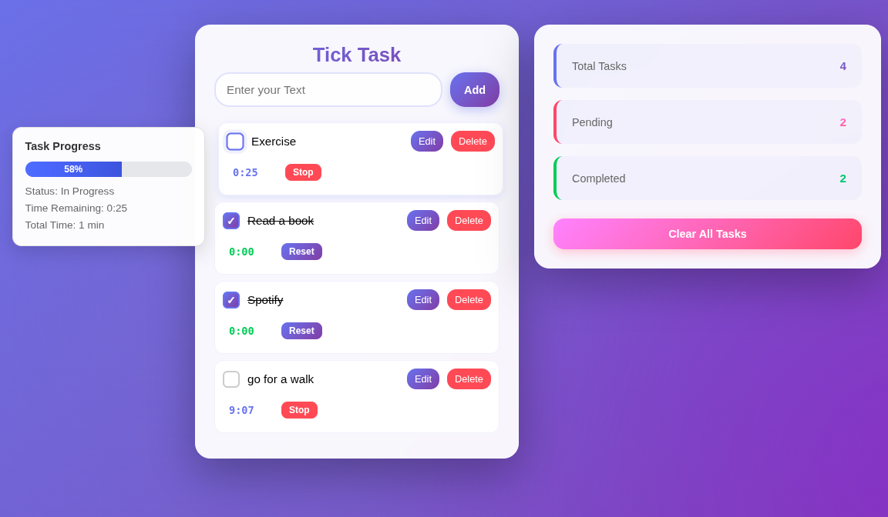

# 📝 Advanced Todo Application with Timer & Progress Tracking

## 🌟 Overview

This is a feature-rich Todo application built with HTML, CSS, and Vanilla JavaScript. It combines task management with built-in timers and real-time progress tracking, making it perfect for time-boxed productivity and task completion monitoring.

The application demonstrates modern JavaScript best practices while maintaining clean, readable code with clear separation of concerns between structure (HTML), styling (CSS), and logic (JavaScript).

---

## 🎯 Purpose of the Project

The primary purpose of this project is to strengthen understanding of JavaScript fundamentals through a real-world, production-ready application. This goes beyond basic todo apps by incorporating:

- **State Management**: Complex state handling with timer management
- **Real-time Updates**: Live countdown timers with interval management and dynamic UI updates
- **Data Persistence**: LocalStorage integration for seamless user experience
- **Interactive UI**: Hover effects with dynamic progress calculations that update in real-time
- **Event-driven Architecture**: Efficient event handling across multiple user interactions

This project demonstrates how to build a complete, professional application using only vanilla JavaScript—no frameworks required.

---

## 👥 Who Can Benefit From This Project

This project is especially valuable for:

- **JavaScript Learners** seeking a comprehensive, real-world example beyond basic tutorials
- **Frontend Developers** practicing DOM manipulation, state management, and timer handling
- **Portfolio Builders** looking for an impressive, functional project to showcase
- **Interview Candidates** demonstrating practical JavaScript skills
- **Educators** needing a teaching resource for intermediate JavaScript concepts
- **Productivity Enthusiasts** who want a customizable time-tracking todo app

---

## ✨ Features

### Core Task Management

- ✅ Add new tasks with a clean, intuitive interface
- ✏️ Edit tasks inline (no dialog prompts)
- 🗑️ Delete individual tasks
- ☑️ Mark tasks as completed with beautiful gradient checkbox animations
- 🧹 Clear all tasks with a single button
- 📊 Real-time statistics dashboard with card-based layout

### Timer & Progress Tracking

- ⏱️ **Individual Task Timers**: Set custom timers (in minutes) for each task
- ▶️ **Start/Stop/Reset Controls**: Full timer control with visual feedback
- ⏰ **Live Countdown**: Real-time countdown display that persists across page reloads
- 📈 **Real-Time Progress Visualization**: Hover over any task to see:
  - Dynamic progress bar that updates every second during countdown
  - Live completion percentage (0-100%) calculated from timer progress
  - Task status (In Progress / Completed)
  - Real-time remaining time display
  - Total time allocated to the task
- 🎨 **Pulsing Timer Animation**: Running timers pulse to indicate active countdown

### Design & UI

- 🌈 **Professional Gradient Design**: Beautiful purple gradient background with glassmorphism effects
- 💎 **Modern Card-Based Stats**: Clean, professional statistics with color-coded indicators
- ✨ **Smooth Animations**: Hover effects, transitions, and micro-interactions throughout
- 🎯 **Smart Tooltip Positioning**: Hover tooltips appear on the left side to avoid overlap
- 📱 **Fully Responsive**: Seamless experience on desktop and mobile devices

### Data & Performance

- 💾 **LocalStorage Persistence**: All tasks and timer states saved automatically
- 🔄 **Auto-restore on Reload**: Tasks and running timers resume exactly where you left off
- ⌨️ **Keyboard Support**: Press Enter to add tasks or save edits, Escape to cancel editing
- 🚀 **Optimized Performance**: Efficient DOM updates and memory management

---

## 🛠️ Technologies Used

- **HTML5** - Semantic structure and accessibility
- **CSS3** - Modern styling with gradients, flexbox, glassmorphism, and animations
- **Vanilla JavaScript (ES6+)** - Core logic, DOM manipulation, and state management
- **LocalStorage API** - Client-side data persistence
- **Interval API** - Real-time timer countdown functionality

---

## 📸 Screenshot



_A modern, professional interface with task timers and real-time hover-activated progress tracking_

---

## 📁 Project Structure

```
todo-timer-app/
│
├── index.html          # Main HTML structure
├── style.css           # Core styling (layout, components, timer UI, tooltips)
├── stats.css           # Statistics section styling (card-based dashboard)
├── app.js            # Application logic (state, timers, DOM, real-time updates)
└── README.md           # Project documentation
```

---

## ⚙️ How the Application Works

### State Management

Each task is stored as an object containing:

```javascript
{
  text: "Task description",
  completed: false,
  timerSet: false,
  timerRunning: false,
  timerMinutes: 25,
  timerSeconds: 1500
}
```

All tasks are maintained in a centralized array representing the application state. Every action (add, edit, complete, delete, timer update) triggers a state update, UI re-render, and localStorage synchronization.

### Timer System

- Timers run using JavaScript's `setInterval()`
- Each timer has its own interval stored in a `timerIntervals` object
- Timer state persists to localStorage every second
- On page reload, running timers automatically resume
- When a timer reaches zero, it displays completion status
- **Real-time tooltip updates**: The `updateTooltip()` function is called every second to refresh progress bars and time displays

### Progress Calculation

The hover tooltip calculates progress dynamically in real-time:

- **No Timer Set**: 0% progress
- **Timer Active**: `(elapsed time / total time) × 100` - updates every second
- **Task Completed**: 100% progress

### Real-Time Updates

The application updates multiple UI elements simultaneously:

- Timer display countdown
- Progress bar width and percentage
- Tooltip details (remaining time, status)
- Visual indicators (colors, animations)

---

## 📊 Task Statistics

The application provides a professional, card-based statistics dashboard with:

- **Total Tasks**: Complete count of all tasks (purple gradient)
- **Pending Tasks**: Tasks not yet marked complete (pink/coral gradient)
- **Completed Tasks**: Tasks marked as done (green gradient)

Each stat card features:

- Color-coded left border for quick visual identification
- Large gradient numbers for easy reading
- Smooth hover animations
- Clean, modern typography

Statistics recalculate instantly on every state change, ensuring accuracy.

---

## 🎓 Learning Outcomes

By studying and building this project, developers gain hands-on experience with:

### JavaScript Fundamentals

- Complex state management without frameworks
- Array methods (`push`, `splice`, `filter`, `forEach`, `map`)
- Object manipulation and property management
- Closure usage for maintaining timer references
- Real-time data synchronization between state and UI

### DOM Manipulation

- Dynamic element creation and removal
- Event listener management and cleanup
- CSS class manipulation for state changes
- Inline editing without browser prompts
- Real-time DOM updates during timer countdowns

### Asynchronous JavaScript

- `setInterval` for real-time updates
- Proper cleanup of intervals to prevent memory leaks
- Managing multiple concurrent timers
- Coordinating multiple asynchronous updates

### Browser APIs

- LocalStorage for data persistence
- JSON serialization and deserialization
- Session state management

### Modern CSS Techniques

- Gradient backgrounds and text effects
- Glassmorphism and backdrop filters
- CSS animations and transitions
- Responsive design patterns
- Custom checkbox styling

### Code Architecture

- Separation of concerns (rendering, state, persistence)
- Reusable function design (`updateTooltip()` for real-time updates)
- Clean, maintainable code structure
- Single responsibility principle

---

## 🚀 Installation & Usage

1. **Clone or Download** the repository

   ```bash
   git clone https://github.com/anjumhere/Advanced-Todo-List.git
   ```

2. **Open `index.html`** in any modern browser

   - No build process required
   - No dependencies to install
   - Works offline after first load

3. **Start Using**:
   - Type a task and press Enter or click "Add"
   - Set a timer by entering minutes and clicking "Set"
   - Start the timer and watch it countdown in real-time
   - Hover over the task text to see live progress updates
   - Mark tasks complete when finished
   - Watch the statistics update automatically

---

## 🔮 Possible Improvements & Extensions

The project can be enhanced further with:

### Features

- 🎨 **Dark Mode Toggle** with theme persistence
- 🔍 **Task Filters** (All, Active, Completed)
- ↩️ **Undo/Redo Functionality** for deleted tasks
- 🏷️ **Task Categories or Tags** for organization
- 🔔 **Desktop Notifications** when timers complete
- 📅 **Due Dates** and calendar integration
- 🔊 **Sound Alerts** for timer completion
- 📤 **Export/Import** tasks as JSON
- 📊 **Analytics Dashboard** showing productivity patterns
- 🎯 **Pomodoro Mode** with automatic break timers

### Technical Enhancements

- 🎭 **Enhanced Animations** for smoother task interactions
- ♿ **Enhanced Accessibility** (ARIA labels, screen reader support)
- 🎯 **Drag-and-drop** for task reordering
- 🌐 **PWA Support** for offline functionality and installation
- ☁️ **Cloud Sync** with backend integration
- 🔐 **User Authentication** for multi-device sync
- 📱 **Native Mobile App** using Capacitor or React Native

---

## 🔑 Key Code Highlights

### Real-Time Tooltip Updates

```javascript
function updateTooltip(li, todo) {
  const tooltip = li.querySelector(".hover-tooltip");
  if (tooltip) {
    // Calculate live progress
    const totalSeconds = todo.timerMinutes * 60;
    const elapsedSeconds = totalSeconds - todo.timerSeconds;
    const percentage = Math.round((elapsedSeconds / totalSeconds) * 100);

    // Update progress bar in real-time
    progressFill.style.width = `${percentage}%`;
    progressFill.textContent = `${percentage}%`;

    // Update time remaining display
    tooltipDetails.innerHTML = `
      <div>Time Remaining: ${formatTime(todo.timerSeconds)}</div>
    `;
  }
}
```

### Timer Management with Real-Time Updates

```javascript
timerIntervals[index] = setInterval(() => {
  todo.timerSeconds--;
  saveTodos();

  // Update timer display
  timerDisplay.textContent = formatTime(todo.timerSeconds);

  // Update tooltip in real-time
  updateTooltip(li, todo);
}, 1000);
```

### Efficient Timer Cleanup

```javascript
// Proper cleanup to prevent memory leaks
if (timerIntervals[index]) {
  clearInterval(timerIntervals[index]);
  delete timerIntervals[index];
}
```

### State Persistence

```javascript
function update() {
  saveTodos(); // Persist to localStorage
  render(); // Update UI
  progress(); // Recalculate stats
}
```

---

## 📝 Code Quality & Best Practices

This project demonstrates:

- ✅ Clean, readable variable naming
- ✅ Consistent code formatting
- ✅ Proper event listener cleanup
- ✅ Memory leak prevention (interval cleanup)
- ✅ Separation of concerns
- ✅ Single responsibility functions
- ✅ DRY (Don't Repeat Yourself) principles
- ✅ Real-time UI synchronization
- ✅ Modular function design

---

## 🎨 Design Features

### Color Palette

- **Primary Purple**: `#667eea` → `#764ba2` (gradients)
- **Secondary Pink**: `#f093fb` → `#f5576c` (accents)
- **Success Green**: `#22c55e` → `#10b981` (completed tasks)
- **Background**: Purple gradient with radial overlays

### UI Components

- Glassmorphism cards with backdrop blur
- Gradient text effects
- Custom styled checkboxes with animations
- Hover tooltips with smooth transitions
- Pulsing animations for active timers
- Card-based statistics dashboard

---

## 🤝 Contributing

Feel free to fork this project and submit pull requests for:

- Bug fixes
- New features
- Performance improvements
- Documentation enhancements
- UI/UX improvements

---

## 📄 License

This project is open source and available for educational and personal use.

---

## 👨‍💻 Author

**Adnan Anjum**

_Building practical JavaScript applications to demonstrate real-world development skills_

---

## 🏷️ Keywords

`javascript` `todo-app` `timer` `productivity` `vanilla-js` `localstorage` `dom-manipulation` `state-management` `portfolio-project` `beginner-friendly` `es6` `frontend-development` `time-tracking` `task-management` `progress-tracker` `real-time-updates` `glassmorphism` `gradient-design` `modern-ui`

---

## ⭐ If You Found This Helpful

Consider giving this project a star ⭐ and sharing it with others learning JavaScript!

---

## 📬 Connect

Feel free to reach out for questions, suggestions, or collaborations!

---

_Last Updated: January 2026_
